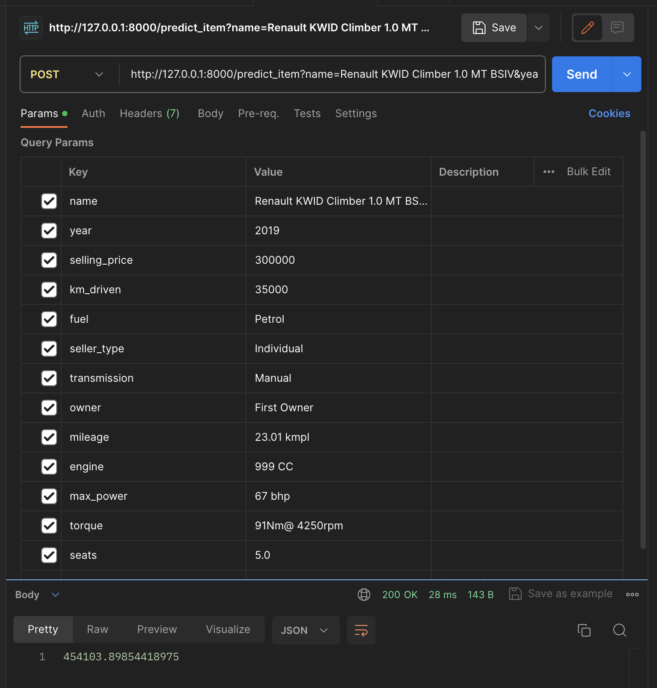

*Домашнее задание 1*

Работу сервиса проверял в Postman. Для предсказания на одном объекте сервис работает так:

Для предсказания на группе объектов:

* что было сделано:

* с какими результатами:

* что дало наибольший буст в качестве:

* что сделать не вышло и почему:
